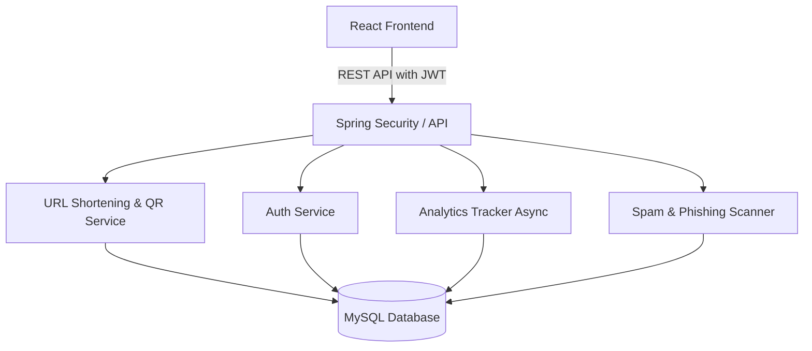

# Software Requirements Specification (SRS)
## Project: SmartURL — Intelligent URL Shortening & Analytics Platform

---

## 1. Introduction

### 1.1 Purpose
This document specifies the software requirements for **SmartURL**, an enterprise-grade URL shortening, QR code generation, spam detection, and real-time analytics platform.

### 1.2 Scope
SmartURL is a modern SaaS platform designed to offer high-speed redirection, deep analytics tracking, security scanning for shortened links, QR code generation, and multi-tenant user management. The system is split into:
1. **Spring Boot REST API**: Secured by JWT authentication, utilizing MySQL for data storage.
2. **React + TypeScript SPA Dashboard**: Styled with Tailwind CSS and ShadCN UI, utilizing Recharts for data visualization.

---

## 2. Overall Description

### 2.1 User Classes and Characteristics
- **Guest / Anonymous User**: Can view the landing page and execute redirects by accessing short URLs.
- **Registered User**: Can manage their own URLs, generate QR codes, view custom analytics dashboards, and edit link parameters.
- **Admin**: Can monitor system health, view all users and links, manage domain blacklists, and block malicious URLs.

### 2.2 System Architecture

---

## 3. System Features & Functional Requirements

### 3.1 Authentication & User Management
- **Registration**: Users can sign up with a name, email, and password. Email must be unique.
- **Login**: Secure login returning JWT access and refresh tokens. Passwords must be hashed using BCrypt.
- **Profile Management**: Users can update their name or change their password.
- **Role-Based Access**: Restricts admin endpoints to users with the `ADMIN` role.

### 3.2 URL Shortening & Management
- **Short URL Generation**: Converts long URLs into a unique 7-character Base62 string.
- **Custom Aliases**: Users can supply a custom string instead of the auto-generated code.
- **Activation Toggle**: Users can temporarily deactivate or activate links.
- **Bulk Shortening**: Supports submitting up to 50 URLs in a single batch.

### 3.3 Spam & Phishing Detection
Every submitted URL undergoes a security check before being shortened:
- **HTTPS Check**: Generates a warning if the protocol is HTTP.
- **IP-Based Domain**: Checks if the target is an IP address instead of a domain name.
- **Suspicious Keyword Check**: Checks the path/query for malicious words (e.g., `login`, `bank`).
- **Obfuscation Detection**: Searches for homoglyphs or excessive special/encoded characters.
- **Blacklist Lookup**: Compares the domain against a database of blacklisted domains.
- **Risk Classification**: Categorizes URLs into `SAFE`, `SUSPICIOUS`, or `HIGH_RISK`. High-risk URLs trigger frontend warnings before creation.

### 3.4 QR Code Generation
- **Automated Creation**: A high-resolution QR code (300x300 pixels) is automatically generated for every created URL.
- **PNG Base64 Storage**: The QR code is stored as Base64 in the database and rendered on the frontend dashboard.
- **Direct Download**: Users can download the QR code PNG image.

### 3.5 Real-Time Analytics
Redirections trigger asynchronous analytics capture:
- **Metrics Tracked**: Total clicks, unique visitors, browser, OS, device type (Mobile/Tablet/Desktop), country, city, referrer, and timestamps.
- **Aggregation**: Backend provides click trends over time (daily) and percentage distributions for charts.

---

## 4. Database Schema Design

### 4.1 Users Table
- `id` (BIGINT, PK, Auto Increment)
- `name` (VARCHAR(100), Not Null)
- `email` (VARCHAR(150), Unique, Not Null)
- `password` (VARCHAR(255), Not Null)
- `role` (VARCHAR(20), Not Null) — `USER`, `ADMIN`
- `is_active` (BOOLEAN, Default True)
- `created_at` (TIMESTAMP)

### 4.2 URLs Table
- `id` (BIGINT, PK, Auto Increment)
- `original_url` (VARCHAR(2048), Not Null)
- `short_code` (VARCHAR(20), Unique, Not Null)
- `custom_alias` (VARCHAR(50), Nullable)
- `qr_code_data` (LONGTEXT, Nullable)
- `is_active` (BOOLEAN, Default True)
- `risk_level` (VARCHAR(20), Not Null) — `SAFE`, `SUSPICIOUS`, `HIGH_RISK`
- `total_clicks` (BIGINT, Default 0)
- `user_id` (BIGINT, FK referencing Users.id)
- `created_at` (TIMESTAMP)

### 4.3 Click Analytics Table
- `id` (BIGINT, PK, Auto Increment)
- `url_id` (BIGINT, FK referencing Urls.id)
- `ip_address` (VARCHAR(45))
- `browser` (VARCHAR(100))
- `device` (VARCHAR(50))
- `os` (VARCHAR(100))
- `country` (VARCHAR(100))
- `city` (VARCHAR(100))
- `referrer` (VARCHAR(500))
- `user_agent` (VARCHAR(500))
- `clicked_at` (TIMESTAMP)

### 4.4 Blacklisted Domains Table
- `id` (BIGINT, PK, Auto Increment)
- `domain` (VARCHAR(255), Unique, Not Null)
- `reason` (VARCHAR(500))
- `created_at` (TIMESTAMP)

---

## 5. Non-Functional Requirements

### 5.1 Performance
- **Low Latency Redirects**: Redirection endpoints (`/s/{shortCode}`) must resolve within 50ms under typical loads. Analytics logging must not block redirection response.
- **Asynchronous Execution**: Click events are queued via a dedicated thread pool to protect database throughput.

### 5.2 Security
- **JWT Lifespans**: Access tokens expire in 15 minutes, while refresh tokens are valid for 7 days.
- **Path Isolation**: Admin actions require role checks at the controller level.
- **Input Sanitization**: All incoming long URLs are validated against URL specification rules.
