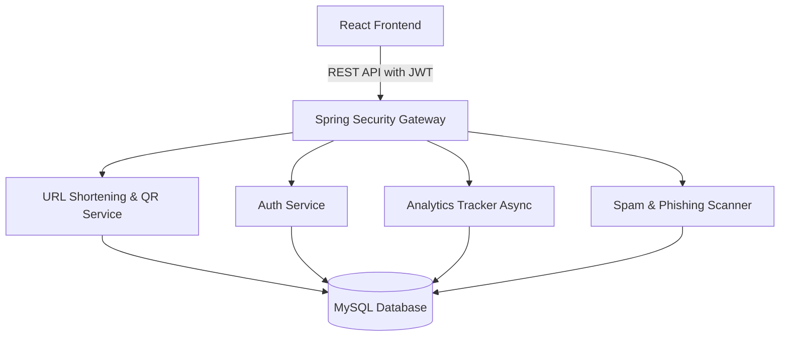

<!-- _class: lead -->

# SmartURL
### Intelligent URL Shortening & Analytics Platform

**Technical & Academic Presentation**
React Dashboard | Spring Boot REST API | Security Scanning

---

## Introduction & Project Motivation

<h3>THE CHALLENGES</h3>

- **Cluttered Links:** Long, unreadable URLs clutter emails, social media, and SMS messages.
- **Security Vulnerabilities:** Anonymous short links hide malware or phishing pages, exposing users.
- **Lack of Analytics:** Standard redirects offer zero visibility into clicks, devices, or geography.

<h3>THE SMARTURL SOLUTION</h3>

- **Branding & Control:** Converts long URLs to clean, memorable Base62 strings or custom branded aliases.
- **Pre-Redirection Scanning:** Performs real-time domain checking, keyword filtering, and blacklist lookups.
- **Rich Event Auditing:** Captures click metrics asynchronously and visualizes trends dynamically.

---

## Core Platform Features

<h3>1. Secure Authentication</h3>

- **JWT Lifecycles:** 15m access token & 7d HTTPOnly refresh token.
- **Passwords:** BCrypt hashing.
- **Role Checks:** Restricts admin routes.

<h3>2. Intelligent Shortening</h3>

- **Base62 Keys:** Generates unique 7-char codes.
- **Custom Aliases:** Custom path names.
- **Bulk Import:** Shortens up to 50 links.

<h3>3. Proactive Security Scanning</h3>

- **Obfuscation Checks:** Flags homoglyphs.
- **Phishing Keywords:** Detects paths/keywords.
- **Blacklist Lookup:** DB-level domain match.

<h3>4. QR Codes & Analytics</h3>

- **Auto-QR Generation:** Renders 300x300 PNGs.
- **Async Logging:** Thread pool performance.
- **Visual Dashboard:** Recharts tracking.

---

## System Architecture & Data Flow

<strong>FRONTEND SPA</strong>
React 19, TS, ShadCN UI, Recharts, Axios

<strong>SECURITY GATEWAY</strong>
Bearer Auth, Role-Based Access Control

<strong>CORE BACK-END</strong>
Spring Boot, JPA/Hibernate, Thread Pool, MySQL

---

## Intelligent Security Scanning

<h3>Pre-Creation Threat Evaluation</h3>

Every user-submitted URL undergoes a 5-step automated scan:
1. **Protocol:** Warnings for plain HTTP.
2. **Numerics Check:** Detects direct IP addresses.
3. **Keyword Scanner:** Identifies bait words.
4. **Homoglyphs:** Flags spoofed letters.
5. **Domain Blacklist:** Match against DB table.

<h3>SAFE</h3>
URL passes all rules. Shortcode and Base64 QR code are created.

<h3>SUSPICIOUS</h3>
Triggers warnings. Visitor is prompted to confirm before redirection.

<h3>HIGH RISK</h3>
Matches blacklist or exploits. Link creation is blocked.

---

## QR Codes & Async Analytics Tracking

<h3>Automated QR Codes</h3>

- **Instant QR Engine:** Renders high-quality 300x300px QR graphic matrices immediately upon link generation.
- **Base64 Storage Model:** Stored natively in the DB as text (base64 string). Reduces downstream API requests.
- **User Download:** Embedded in link cards. Clients can trigger high-res PNG downloads directly in the browser dashboard.

<h3>Asynchronous Analytics Engine</h3>

- **Multi-Attribute Logging:** Captures IP, Browser, Operating System (OS), Device types, Country, City, Referrers, and timestamps.
- **Asynchronous Threads:** Event captures run on a dedicated Spring TaskExecutor pool. Keeps redirects extremely fast (<50ms).
- **Dashboard Visuals:** React dashboard pulls aggregated metrics, feeding interactive Recharts.

---

## Database Schema Design

| Table Name | Primary Key | Core Columns / Properties | Foreign Keys & Relationships |
| :--- | :--- | :--- | :--- |
| **Users** | `id` (BIGINT) | name, email (Unique), password (BCrypt), role (USER/ADMIN), is_active, created_at | Parent of URLs table (One-to-Many) |
| **URLs** | `id` (BIGINT) | original_url, short_code (Unique), custom_alias, qr_code_data (LONGTEXT), risk_level, total_clicks, created_at | `user_id` (FK to Users.id), Parent of Click Analytics |
| **Click Analytics** | `id` (BIGINT) | ip_address, browser, device, os, country, city, referrer, user_agent, clicked_at | `url_id` (FK to URLs.id) |
| **Blacklisted Domains** | `id` (BIGINT) | domain (Unique), reason, created_at | Independent validation index |

---

## Technology Stack & Tooling

<h3>Backend Enterprise Architecture</h3>

- **Spring Boot:** REST API controllers, business logic, and core services.
- **Spring Security:** JWT authentication filter chain and RBAC context.
- **Spring Data JPA:** Hibernate ORM mapping.
- **MySQL Database:** Relational storage with indexing for fast lookups.
- **Maven:** Dependency and build management.

<h3>Frontend Single Page Application</h3>

- **React 19 SPA:** Component-driven dashboard and client layout.
- **TypeScript:** Enforces type safety and strict type interfaces.
- **Vite:** High-performance, hot-module-replacement bundler.
- **Tailwind CSS:** Modern utility-first CSS styling.
- **Recharts & ShadCN:** Sleek, accessible UI elements and charts.

---

## Performance & Security Benchmarks

<h3>Performance Highlights</h3>

- **Low Redirection Latency:** Redirection resolves within 50ms overhead, optimized by database index matching.
- **Non-Blocking Analytics:** Click logs are pushed asynchronously to a Spring thread pool, protecting DB write locks.
- **HikariCP Connection Pool:** Manages concurrent connections to handle scale spikes gracefully.

<h3>Security Safeguards</h3>

- **Token Expirations:** 15-minute JWT access tokens and secure 7-day refresh tokens.
- **Cryptographic Hashing:** Salted BCrypt password encoding.
- **Input Sanitization:** URL path decoding, normalization, and validation rules to defeat injection vectors.

---

<!-- _class: lead -->

# Conclusion
## SmartURL — Project Achievements Summary

- **Enterprise-Grade Architecture:** A complete, production-ready fullstack platform matching modern engineering practices.
- **Redirection with Security:** Successfully blends microsecond redirects with detailed threat scans to safeguard visitors.
- **Actionable Analytics:** Provides immediate data visibility through background thread tracking and React charts.
- **Scalable Tech Stack:** Built on high-stability, highly supported ecosystems: Spring Boot, React, and MySQL.
